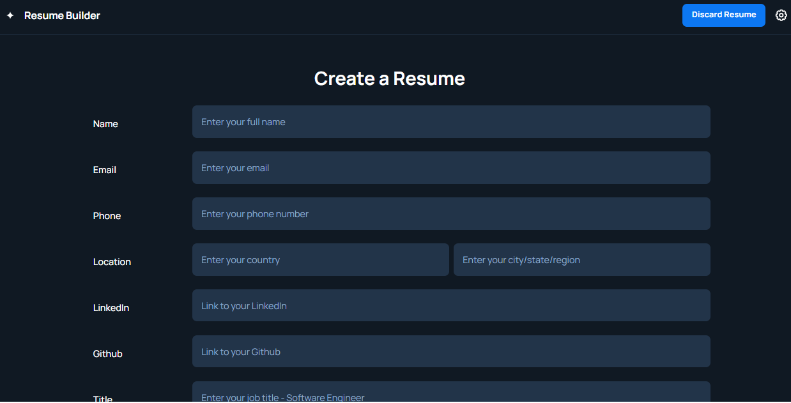

# Resume Builder

A simple web-based resume generator. Users can fill out a form with their personal and professional details, and the app generates a styled HTML resume that can be downloaded as a PDF.

---

---

## ✨ Features
- 📋 Input details through a clean web form  
- 🖼️ Automatically render details into a resume template (`new_resume.html` / `resume_2.html`)  
- 📄 Download the generated resume and **export as PDF**  
- 🎨 Easy to extend with new templates and styles  

---

## 📸 Screenshots
<!-- Replace with actual images -->
  
*User-friendly form input*

  
*Generated resume preview*

---

## ⚠️ Current Limitations
- Running directly in a browser without a server may result in missing form-to-template data.  
- AI-assisted completion of resume fields is not yet implemented.  
- DOCX export is not yet supported.  
- Only a limited number of resume templates are available.  

---

## 🛠️ Planned Features
- 🤖 AI-assisted field suggestions  
- 📑 Export to DOCX  
- 🎨 Additional templates and styling options  

---

## 🔧 Getting Started

### Prerequisites
- A simple web server (e.g., Python, Node, or any static server)  
- Modern browser (Chrome, Firefox, Edge, etc.)

### Running Locally
```bash
# Using Python's built-in server
cd resume_builder
python3 -m http.server 8080
